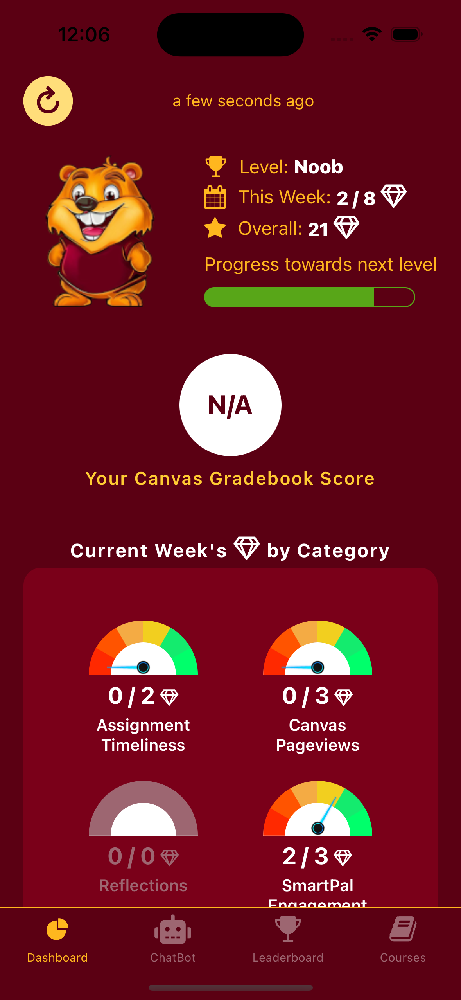

# SmartPal Instructor Guide

Last Revision: December 22, 2024

## Overview

The overarching goal of the project is to enhance student engagement and learning performance and empower instructors with data driven insights and tools using various learning technologies including Generative AI, chatbot, and gamification. 

SmartPal leverages information obtained using Canvas API to serve students and instructors. It bridges the gaps between Canvas, students, and instructors.

- **For students**: We provide an iOS/Android app serves as a personal learning assistant connected to Canvas. The app has a build-in GenAI-powered chatbot, a dashboard, and a leaderboard. Students can ask the chatbot courses related questions and also receive chatbot-initiated reminders, updates, and nudges. 
- **For instructors**: We provide weekly newsletters via email and a web-based teacher dashboard. Below, we describe SmartPal in a bit more detail. 

The current SmartPal deployment is primarily meant to support research, which entails evaluation of a few learning technologies and their designs. We use the information gathered to drive insights on impact and effectiveness of technologies and suggest design improvements.

Here is a short demo of SmartPal [https://www.youtube.com/watch?v=frgNlcm70XM](https://www.youtube.com/watch?v=frgNlcm70XM)

## How Does SmartPal Interact with Students?

SmartPal is designed to enhance course engagement throughout the learning lifecycle. It uses a combination of chatbot and gamification to achieve this goal. 

- **Chatbot**: The GenAI-powered chatbot is designed to answer student questions about the course ("pull" from students) as well as sending students reminders, updates, encouragements, and nudges ("push" to students) 
- **Gamification**: we use game elements such as gems, levels, avatars, and leaderboards to motivate course engagement. Our gamification system tracks and reward several engagement indicators such as on-time submission, Canvas pageviews, answering self-reflection questions, and SmartPal app check-ins (see Appendix for more details) 
  
The SmartPal app consists of three main screens: 

- **Dashboard**: Students see current course score and upcoming dues, synced from Canvas/
- **Chatbot**: Students can ask the chatbot course-related questions and receive chatbot-initiated messages
- **Leaderboard**: It features top ~20% most-engaged students based on the weekly or accumulated gems. 

   

## How Does SmartPal Interact with Instructors?

- A **weekly report** via email with information such as (A [sample email](https://docs.google.com/document/d/1y1XJ1_RUTXAdj9aU2CtxjoOmzuQbKMfKEGO361hy_zI/edit?usp=sharing)):  
    - Current Score
    - Course Goal
    - Days since last activity
    - Hours on Canvas (all time)
    - Pageviews of this week
    - Gems received this week
    - Gems received all time
- An **instructor portal**: A web-based instructor portal with live student progress information and more ways to view such information and interact with SmartPal. 

## What Are Needed from Instructors?

### Before The Term Starts

1. **Giving SmartPal Access to Your Canvas Course**. 
      - We ask you to **add SmartPal (smartpal@umn.edu) as an Teacher** to your course. This gives us access to your course, and we can use this teacher role to retrieve course and student information using Canvas API, and make updates such as upload SmartPal related documents and grades.
      - Sometimes, we may add one or two members of the research team as an observer or TA (*you don't need to do anything*), e.g. Tao Li (li003479@umn.edu) and Fagun Raithatha (raith011@umn.edu) 
2. **Determine the Participation Incentives**: As part of the research, we need students to complete a pre survey (at the beginning of the semester) and a post survey (at the end), and to install the SmartPal app. Students may require some incentives to complete these steps.  
      - We recommend **1% worth of extra credit (or course credit)** given to students for this research participation. That said, we can still deploy SmartPal without credit incentives, though our past experiences indicate that students are less likely to try the app or complete the surveys.
      - **Please let us know whether you are willing to offer such extra points/credits, and how much.** 
3. **Include Syllabus Language about SmartPal**: Include some language about SmartPal in the syllabus, which we will share with you.  
4. **(Optional) Checklist for Canvas**:The follow checklist can help SmartPal better answer student questions.
      - Always set **due dates** for deliverables such as assignments and quizzes.
      - Include **descriptions** for exams, quizzes, and modules (e.g. what topics do they cover, exam preparation tips etc)
      - Using a **grading scheme**: [See a guide here](https://community.canvaslms.com/t5/Admin-Guide/How-do-I-add-a-grading-scheme-in-an-account/ta-p/146), so that we can translate the Canvas course score into a letter grade.
      - Maintain the Canvas grade book to provide an accurate running total, including:
          - Ensure that every assignment has a **point value** assigned to enable correct grade calculation. 
          - Regularly enter grades for all assignments
          - Utilize [**weighted assignment groups**](https://community.canvaslms.com/t5/Instructor-Guide/How-do-I-weight-the-final-course-grade-based-on-assignment/ta-p/746) if you use weighted grading.
          - Enter **"0" for missing submissions** (Canvas ignores all ungraded assignments when calculating a student’s total grade, even those that are past due)
      - Offer the **syllabus** using Canvas's "Syllabus" function(an inline syllabus is preferred over an attachment): [See a guide here](https://community.canvaslms.com/t5/Instructor-Guide/How-do-I-use-the-Syllabus-as-an-instructor/ta-p/638).
      - For subjectively graded questions, it would be helpful to use a grading rubric: [See a guide here](https://community.canvaslms.com/t5/Instructor-Guide/How-do-I-add-a-rubric-to-an-assignment/ta-p/1058).

### On the first day of class

We will ask you to show some slides/a short video about SmartPal, and encourage them to participate in this research.  

### At the end of the term

Usually, we keep smartpal-related grades updated and such grades are **finalized by the last day of instruction**. You may let us know if you have any question about the SmartPal grades (deliu@umn.edu).

## What Canvas Changes Can SmartPal Make?

SmartPal is restricted to only making changes to Canvas elements that are directly related to SmartPal. 

We may make these changes on behalf of the instructor:

- Creating a Module for SmartPal
- Upload or update SmartPal related documents (User Guide, IRB Information Sheet, etc)
- Create or update SmartPal related assignments (e.g. filling out surveys, installing the app) with appropriate point values based on the agreed-upon participation incentives. 
- Set or change the due dates for SmartPal related assignments
- Create an assignment group for SmartPal related assignments
- Post SmartPal-related grades
- Email students about SmartPal from smartpal@umn.edu
- Add members of the SmartPal research team as an observer or TA, only on a necessary basis.

We will not do the following:

- We do not make any change to Canvas elements that are unrelated to SmartPal.
- We do not post Canvas announcement unless we have asked and gotten your permission.

## Contact

- Please forward SmartPal-related student queries to [smartpal@umn.edu](mailto:smartpal@umn.edu). 
- Instructors please feel free to contact De Liu ([deliu@umn.edu](deliu@umn.edu)) directly. 
